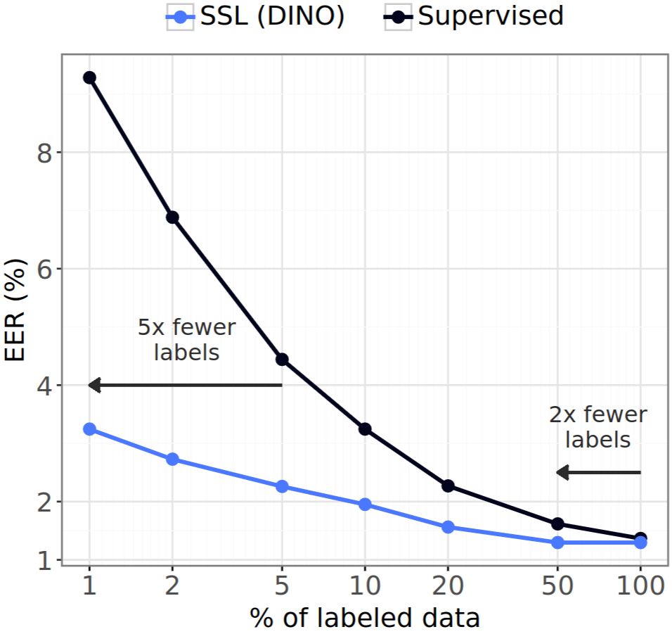

During [my PhD](https://theolepage.com/phd_thesis), I worked extensively on **self-supervised learning** for **speaker verification**, a task that aims to learn speaker representations without relying on speaker labels during training. Over the years, self-supervised "instance-invariance" frameworks originally developed for computer vision, such as SimCLR, MoCo, SwAV, VICReg, and DINO, have demonstrated strong potential for learning discriminative representations in many domains. Naturally, I became interested in understanding how well these approaches could transfer to the downstream task of speaker recognition.

However, experimenting with self-supervised methods quickly became challenging. Most approaches were originally designed for images, meaning that adapting them to audio often required modifications to data pipelines, augmentations, training strategies, and evaluation protocols. At the same time, existing codebases were usually focused on a single framework, were difficult to extend, or were implemented under different settings, making fair comparisons difficult.

As my research progressed, I repeatedly found myself re-implementing methods, reproducing experiments, and building tooling around training, evaluation, and reproducibility. What started as research code gradually evolved into **`sslsv`**, an open-source PyTorch toolkit dedicated to self-supervised learning (**`ssl`**) for speaker verification (**`sv`**).

<div style="display: flex; flex-direction: column; align-items: center; margin: 34px 0 28px 0;">
    
    <a href="https://github.com/theolepage/sslsv" target="_blank" rel="noopener noreferrer">https://github.com/theolepage/sslsv</a>
</div>

The main objective behind `sslsv` was twofold: (1) provide implementations of major **state-of-the-art self-supervised frameworks adapted to speaker recognition**; and (2) evaluate them within a **consistent, reproducible, and comparable environment**. Over time, the toolkit grew to support multiple speaker encoders, training setups, evaluation protocols, benchmarks across several speaker-related downstream tasks, and research contributions developed during my PhD.


# Project Overview

## Goals and Design Philosophy

One of the primary goals of `sslsv` is **reproducibility**. Research code often grows organically and quickly becomes difficult to maintain or reproduce. To address this issue, the toolkit was designed around structured experiment configurations, standardized training procedures, and consistent evaluation pipelines. This makes it easier to reproduce experiments, compare methods under controlled settings, and revisit experiments months later without guessing which hyperparameters were used.

Another key objective is enabling **fair comparisons between methods**. Since many self-supervised frameworks were originally proposed for computer vision under different assumptions and training protocols, comparing them fairly in the context of speaker verification can be surprisingly difficult. In `sslsv`, methods are evaluated using consistent datasets, augmentations, encoders, and training procedures whenever possible.

The toolkit was also designed with **modularity and extensibility** in mind. New backbone encoders, self-supervised methods, losses, or evaluation pipelines can be integrated with minimal effort, making the framework suitable not only for reproducing experiments but also for rapidly prototyping new research ideas.

Finally, `sslsv` relies on **configuration-driven experimentation**. All aspects of an experiment, including the encoder, self-supervised method, datasets, augmentations, training hyperparameters, and evaluation settings, are defined through structured YAML configuration files. This approach significantly reduces boilerplate code while improving clarity and reproducibility. This also makes it easier to reproduce published results and compare experiments across settings.

## Self-Supervised Frameworks

Over time, `sslsv` grew to include implementations of a broad collection of **self-supervised frameworks** adapted for speaker verification. These include early speech-oriented methods such as **[LIM](https://arxiv.org/pdf/1812.00271)**; contrastive approaches including **[CPC](https://arxiv.org/pdf/1807.03748)**, **[SimCLR](https://arxiv.org/pdf/2002.05709)** and **[MoCo v2+](https://arxiv.org/pdf/2003.04297)**; clustering-based methods such as **[DeepCluster v2](https://arxiv.org/pdf/1807.05520)** and **[SwAV](https://arxiv.org/pdf/2006.09882)**; information maximization approaches including **[W-MSE](https://arxiv.org/pdf/2007.06346)**, **[Barlow Twins](https://arxiv.org/pdf/2103.03230)**, **[VICReg](https://arxiv.org/pdf/2105.04906)**, and **[VIbCReg](https://arxiv.org/pdf/2109.00783)**; as well as self-distillation methods such as **[BYOL](https://arxiv.org/pdf/2006.07733)**, **[SimSiam](https://arxiv.org/pdf/2011.10566)**, and **[DINO](https://arxiv.org/pdf/2104.14294)**. The overall training and evaluation workflow implemented in sslsv is illustrated below, highlighting the standard self-supervised learning pipeline used for speaker verification.

<figure>
  
  <figcaption>
    Overview of the standard self-supervised instance-invariance framework for speaker verification.
  </figcaption>
</figure>

## Features

`sslsv` supports multiple **speaker encoder architectures**, including [**TDNN (x-vectors)**](https://www.danielpovey.com/files/2018_icassp_xvectors.pdf), [**ResNet-34**](https://arxiv.org/pdf/1806.05622), [**ECAPA-TDNN**](https://arxiv.org/pdf/2005.07143), and pretrained speech foundation models through [s3prl](https://github.com/s3prl/s3prl), such as [**wav2vec 2.0**](https://arxiv.org/abs/2006.11477), [**HuBERT**](https://arxiv.org/abs/2106.07447), and [**WavLM**](https://arxiv.org/abs/2110.13900).

The toolkit also provides a complete **training infrastructure** supporting CPU, GPU, and multi-GPU training through both [DataParallel (DP)](https://docs.pytorch.org/docs/2.12/generated/torch.nn.DataParallel.html) and [DistributedDataParallel (DDP)](https://docs.pytorch.org/docs/2.12/generated/torch.nn.parallel.DistributedDataParallel.html). Features such as checkpointing, resuming, early stopping, TensorBoard logging, and Weights & Biases integration are also included.

Additionally, `sslsv` implements a comprehensive **evaluation pipeline** for speaker verification and speaker-related downstream tasks. Supported backends include cosine scoring (with Z/T/S/AS-Norm) and PLDA, alongside standard evaluation metrics such as **EER**, **minDCF**, **actDCF**, **CLLR**, and **AvgRPrec**.

To facilitate analysis and interpretation of learned speaker embeddings, `sslsv` includes several **visualization utilities**, including DET curves, score distributions, t-SNE visualizations, and intra/inter-class similarity analyses.

## Research Contributions

Beyond reproducing existing self-supervised methods, `sslsv` also integrates research contributions developed during [my PhD](https://theolepage.com/phd_thesis), notably [**SimCLR/MoCo Margins**](https://arxiv.org/pdf/2404.14913) and [**SSPS (Self-Supervised Positive Sampling)**](https://arxiv.org/pdf/2501.17772). All associated papers, checkpoints, and reproducible experiment configurations are publicly available through the repository.


# Getting Started

One of the main goals of `sslsv` is to make experimentation with self-supervised speaker verification as straightforward and reproducible as possible. Whether the objective is reproducing published experiments, benchmarking self-supervised frameworks, or prototyping new research ideas, the toolkit provides a relatively simple workflow for getting started.

## Installation

Installing `sslsv` only requires a few steps. The repository can first be cloned from GitHub:

```bash
git clone https://github.com/theolepage/sslsv.git
cd sslsv
```

The required dependencies can then be installed with:

```bash
pip install -r requirements.txt
```

For convenience, `sslsv` can also be installed directly as a Python package:

```bash
pip install sslsv
```

or locally from the project root:

```bash
pip install .
```

This can be useful when modifying the codebase or experimenting with custom methods and components.

## Preparing Data

`sslsv` supports several datasets commonly used in speaker and speech-related tasks. For speaker verification, this includes [**VoxCeleb1**](https://www.robots.ox.ac.uk/~vgg/data/voxceleb/vox1.html), [**VoxCeleb2**](https://www.robots.ox.ac.uk/~vgg/data/voxceleb/vox2.html), [**SITW**](http://www.speech.sri.com/projects/sitw/), and [**VOiCES**](https://iqtlabs.github.io/voices/). The toolkit also supports [**VoxLingua107**](https://bark.phon.ioc.ee/voxlingua107/) for language recognition and [**CREMA-D**](https://github.com/CheyneyComputerScience/CREMA-D) for emotion recognition. `sslsv` also integrates standard audio augmentation datasets such as [**MUSAN**](http://www.openslr.org/17/) and the [**Room Impulse Response and Noise Database (RIR)**](https://www.openslr.org/28/).

For the main speaker verification experiments, datasets can be automatically downloaded, extracted, and prepared using the provided scripts:

```bash
python tools/prepare_data/prepare_voxceleb.py data/
python tools/prepare_data/prepare_augmentation.py data/
```

## Running Experiments

Once the environment and datasets are ready, training and evaluation can be launched with only a few commands.

For distributed training on multiple GPUs:

```bash
./train_ddp.sh 2 <config_path>
```

Similarly, model evaluation can be performed with:

```bash
./evaluate_ddp.sh 2 <config_path>
```

For smaller experiments, `sslsv` also supports CPU and single-GPU execution through dedicated Python entry points.

Training progress and experiment statistics can be monitored using **TensorBoard** (`tensorboard --logdir models/your_model/`) and **Weights & Biases (wandb)**.

Overall, the workflow is intentionally designed to remain lightweight: prepare the data, select a configuration file, launch training, and evaluate the resulting model.


# Benchmarks

One of the main motivations behind `sslsv` was to provide a **consistent environment for comparing self-supervised methods for speaker verification**. Since many self-supervised frameworks originate from computer vision, reproducing them under a unified setup makes it possible to better understand which approaches transfer effectively to speaker recognition.

Unless otherwise stated, the results below were obtained by training on **VoxCeleb2** and evaluating on **VoxCeleb1-O**, using an **ECAPA-TDNN encoder** and a common evaluation pipeline. Pretrained checkpoints are available for all models (🔗).

## Results for Self-Supervised Frameworks

The table below presents a subset of representative self-supervised frameworks implemented in `sslsv`.

| Method         | Model                                                                                   | EER&nbsp;↓ | minDCF&nbsp;↓ |                                                                                      |
|----------------|-----------------------------------------------------------------------------------------|:-------:|:---------------:|:----------------------------------------------------------------------------------------------:|
| **SimCLR** 🥈     | `ssl/voxceleb2/simclr/simclr_enc-ECAPATDNN-1024_proj-none_t-0.03`                                     | 6.41    | 0.5160          | [🔗](https://drive.google.com/drive/folders/1ziVtNDFspiC1Qbj8kbqb5s9e1LW98Vmt?usp=sharing) |
| **MoCo** 🥉       | `ssl/voxceleb2/moco/moco_enc-ECAPATDNN-1024_proj-none_Q-32768_t-0.03_m-0.999`                         | 6.48    | 0.5372          | [🔗](https://drive.google.com/drive/folders/1obndtNWHm8I4-9rhxugS7OFlUbFhCNGh?usp=sharing) |
| **SwAV**       | `ssl/voxceleb2/swav/swav_enc-ECAPATDNN-1024_proj-2048-BN-R-2048-BN-R-512_K-6000_t-0.1`                | 8.12    | 0.6148          | [🔗](https://drive.google.com/drive/folders/1_oDDza2fau84tZA060Wy8xZfy_guAy6w?usp=sharing) |
| **VICReg**     | `ssl/voxceleb2/vicreg/vicreg_enc-ECAPATDNN-1024_proj-2048-BN-R-2048-BN-R-512_inv-1.0_var-1.0_cov-0.1` | 7.42    | 0.5659          | [🔗](https://drive.google.com/drive/folders/1Ir37Nh6O38biOvHeW6pzgcMB8oOaAdEg?usp=sharing) |
| **DINO** 🥇       | `ssl/voxceleb2/dino/dino_enc-ECAPATDNN-1024_proj-2048-BN-G-2048-BN-G-256-L2-65536_G-2x4_L-4x2_t-0.04` | 2.82    | 0.3463          | [🔗](https://drive.google.com/drive/folders/1_4jkqiumnFjHfMcYrm8ckpRo85c4Gdqd?usp=sharing) |
| **Supervised** | `ssl/voxceleb2/supervised/supervised_enc-ECAPATDNN-1024_loss-AAM_s-30_m-0.2`                          | 1.34    | 0.1521          | [🔗](https://drive.google.com/drive/folders/1ZTXgZeWv9dbnosLzMtHU4wSQXvg9M-SF?usp=sharing) |

Among the evaluated self-supervised frameworks, **DINO** achieves the best performance with an **EER of 2.82%**, followed by **SimCLR** (**6.41%**) and **MoCo** (**6.48%**). These results highlight the strong transferability of self-supervised learning to speaker verification. Nevertheless, a substantial gap still remains compared to a **fully supervised system**, which achieves an **EER of 1.34%**, leaving room for further improvements in self-supervised speaker representation learning.

## Results with SSPS

One of the main contributions integrated into `sslsv` is [**SSPS (Self-Supervised Positive Sampling)**](https://arxiv.org/pdf/2501.17772), a method designed to **exploit latent space proximity to sample cross-recording pseudo-positives** for self-supervised speaker verification.

Traditional self-supervised frameworks typically construct positive pairs using different augmentations of the same speech segment, which can encourage the model to rely on recording-related cues shared across the sample and inadvertently encoded into the representation. SSPS addresses this limitation by leveraging the structure of the latent space to identify utterances from different recordings that are likely to belong to the same speaker, with the objective of learning more speaker-discriminative representations.


The table below illustrates the effect of SSPS when integrated into major self-supervised frameworks:

| Method         | Model                                                                              | EER&nbsp;↓ | minDCF&nbsp;↓ |                                                                                      |
|----------------|------------------------------------------------------------------------------------|:-------:|:---------------:|:----------------------------------------------------------------------------------------------:|
| **SimCLR&nbsp;+&nbsp;SSPS**     | `ssps/voxceleb2/simclr_e-ecapa/ssps_kmeans_25k_uni-1`                                             | 2.57    | 0.3033          | [🔗](https://drive.google.com/drive/folders/1Uv09fswUNDCbhrxR8_e8kOLVa60KB2rW?usp=sharing) |
| **DINO&nbsp;+&nbsp;SSPS**       | `ssps/voxceleb2/dino_e-ecapa/ssps_kmeans_25k_uni-1`                                               | 2.53    | 0.2843          | [🔗](https://drive.google.com/drive/folders/1wgtHkaha6O0lIT0hN3Hcf8bGIk9wHBA1?usp=sharing) |

SSPS provides substantial improvements to these two frameworks, reducing the EER of **SimCLR** (from **6.41%** to **2.57%**) and **DINO** (from **2.82%** to **2.53%**). These results highlight the importance of positive sampling for **shaping the information encoded in learned representations**, ultimately guiding self-supervised learning toward more speaker-discriminative features.

## Label-efficiency

To evaluate the **label-efficiency** of self-supervised learning, the figure below compares the performance of a **DINO-based self-supervised model** and a **fully supervised baseline** as a function of the proportion of labeled training data.

<figure style="max-width: 400px; margin: auto;">
  
</figure>

Even with substantially fewer labels, the self-supervised model consistently outperforms the supervised counterpart, highlighting the potential of self-supervised learning to reduce annotation requirements while maintaining strong speaker verification performance. Notably, the DINO model achieves performance comparable to the supervised baseline with up to **2× fewer labels** (100% vs. 50%) and even **5× fewer labels** in low-resource settings (5% vs. 1%).


# Architecture & Implementation Details

Beyond implementing self-supervised learning methods, a significant part of building `sslsv` involved designing a framework that remained **modular, extensible, and reproducible** as the project grew throughout my PhD. Research code has a tendency to evolve organically into a collection of scripts and partially reproducible experiments. Therefore, one of the goals of `sslsv` was to avoid this issue by building a toolkit structured around reusable components and configuration-driven experimentation.

## Configuration System

At the core of `sslsv` lies a **configuration system** designed to centralize every aspect of an experiment. Internally, configurations are implemented using **Python dataclasses**,  which define structured default values for all settings. These defaults can then be selectively **overridden through YAML configuration files**, allowing experiments to remain both flexible and reproducible without modifying the codebase directly. Configuration files are organized by project and dataset, making it straightforward to reproduce published experiments or compare different settings under controlled conditions.

A simplified example of a DINO configuration is shown below:

```yaml
encoder:
  type: 'resnet34'
method:
  type: 'dino'
evaluation:
  validation:
    - type: 'sv_cosine'
  test:
    - type: 'sv_cosine'
      frame_length: null
dataset:
  ssl: true
  frame_length: 64000
  frame_sampling: 'dino'
  train: 'voxceleb2_train.csv'
  augmentation:
    enable: true
```

In practice, this design proved particularly useful during my PhD, where running dozens (or sometimes hundreds) of experiments quickly made manual configuration impractical.

## Modular Architecture

The codebase is organized into several dedicated modules, each responsible for a specific aspect of the toolkit.

* **`bin`** contains the main scripts for training, evaluation, and inference;
* **`encoders`** implements speaker encoder architectures;
* **`methods`** implements self-supervised methods;
* **`datasets`** handles data loading, sampling, and audio augmentation;
* **`evaluation`** includes speaker verification and other evaluation pipelines;
* **`trainer`** provides training functionalities;
* **`utils`** contains general-purpose helper functions used throughout the project.

This modular organization makes it easier to maintain the codebase while keeping the implementation of new methods relatively lightweight. In many cases, adding a new framework only requires implementing the method-specific logic while reusing the existing infrastructure for training and evaluation.

## Base Classes and Method Design

One of the design choices that proved particularly useful was the introduction of **base classes** for encoders (`_BaseEncoder.py`), methods (`_BaseMethod.py`, `_BaseSiameseMethod.py`, `_BaseMomentumMethod.py`), and evaluation (`_BaseEvaluation.py`) components. Note that a method corresponds to an encoder, additional modules (e.g., projector/predictor), and the associated training logic. This abstraction makes it possible to implement new methods while reusing large parts of the training pipeline.

A simplified implementation of the DINO method is illustrated below:

```python
# Note: Simplified version of the original code with typing and comments omitted

import torch

from sslsv.methods._BaseMomentumMethod import BaseMomentumMethod, BaseMomentumMethodConfig, initialize_momentum_params

from sslsv.methods.DINO.DINOHead import DINOHead
from sslsv.methods.DINO.DINOLoss import DINOLoss

class DINO(BaseMomentumMethod):

    def __init__(self, config, create_encoder_fn):
        super().__init__(config, create_encoder_fn)

        self.head = DINOHead(...)
        self.head_momentum = DINOHead(...)
        initialize_momentum_params(self.head, self.head_momentum)

        self.loss_fn = DINOLoss(...)

    def forward(self, X, training = False):
        if not training:
            return self.encoder_momentum(X)

        T = self.head_momentum(self.encoder_momentum(get_global_frames(X)))
        S = torch.cat((
            self.head(self.encoder(get_global_frames(X))),
            self.head(self.encoder(get_local_frames(X)))
        ), axis=0)
        return S, T

    def get_learnable_params(self):
        return super().get_learnable_params() + [{"params": self.head.parameters()}]

    def get_momentum_pairs(self):
        return super().get_momentum_pairs() + [(self.head, self.head_momentum)]

    def train_step(self, Z):
        S, T = Z
        loss = self.loss_fn(S, T)
        self.log_step_metrics({"train/loss": loss})
        return loss
```

## Distributed Training

Handling **distributed training** through PyTorch's [DistributedDataParallel (DDP)](https://docs.pytorch.org/docs/2.12/generated/torch.nn.parallel.DistributedDataParallel.html) is an important aspect of the toolkit. The implementation is therefore adapted according to the requirements of each self-supervised method. For example, SimCLR gathers embeddings across processes to construct a global set of negative examples. To support these operations, `sslsv` includes custom distributed utilities designed to correctly synchronize embeddings while preserving gradient propagation.

Although distributed training can quickly become complex in research code, integrating it directly into the toolkit made large-scale comparisons significantly more practical by reducing training time.

## Development Practices

As the toolkit expanded, software engineering practices became increasingly important for maintaining reliability and readability. The codebase therefore adopts several standard development practices, including **type annotations**, **documentation**, **unit tests**, and consistent coding conventions.

While `sslsv` initially started as research code written for experiments, investing time into maintainability ultimately made the toolkit easier to extend, debug, and reuse across projects.


# Conclusion

What started as a collection of research scripts gradually evolved into a reusable toolkit that powered most of the experiments throughout my PhD. Over the years, `sslsv` became a practical framework for implementing, benchmarking, and extending self-supervised learning methods for speaker verification in a unified and reproducible environment.

Beyond reproducing existing approaches, the toolkit also served as a research platform for exploring new ideas, leading to [several research contributions]((https://theolepage.com/phd_thesis)). More importantly, it helped answer a question that motivated my research: *how effectively can self-supervised learning transfer to speaker recognition, and how can its performance be further improved?*

As there are still many directions worth exploring, I hope `sslsv` can be useful to researchers and practitioners interested in self-supervised speaker verification and, more broadly, speech representation learning.


# References and Resources

The source code, pretrained checkpoints, and experiment configurations are available on GitHub at the following address: https://github.com/theolepage/sslsv.

If you end up using `sslsv` in your work, please consider starring the repository on GitHub and citing the associated papers.

## Associated Research

The toolkit is closely tied to several publications developed during my PhD. If you use `sslsv`, please consider citing the following paper:

```bibtex
@Article{lepage2025SLSRReview,
  title   = {Self-Supervised Learning for Speaker Recognition: A study and review},
  author  = {Lepage, Theo and Dehak, Reda},
  year    = {2026},
  journal = {Speech Communication},
  volume  = {176},
  pages   = {103333},
  doi     = {10.1016/j.specom.2025.103333},
  url     = {https://arxiv.org/pdf/2602.10829}
}
```

## Acknowledgements

`sslsv` contains third-party components and code adapted from several open-source projects, including:

* `voxceleb_trainer`: https://github.com/clovaai/voxceleb_trainer
* `voxceleb_unsupervised`: https://github.com/joonson/voxceleb_unsupervised
* `solo-learn`: https://github.com/vturrisi/solo-learn

Their contributions significantly helped shape the development of the toolkit.
